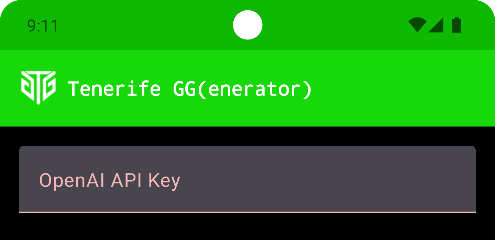
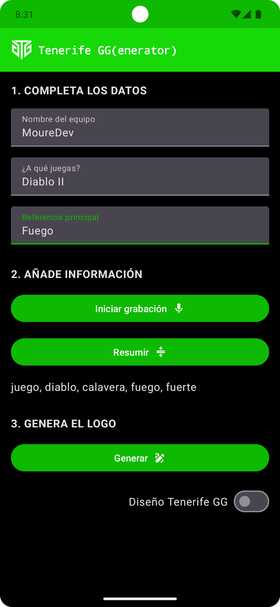
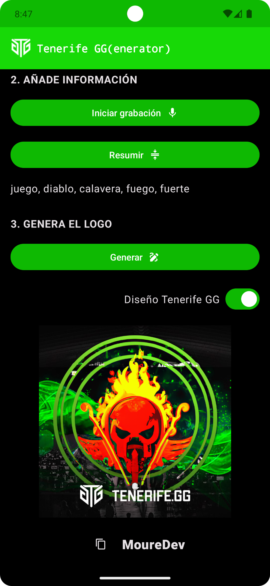

# Tenerife GG(enerator)
## Generador de logotipos de eSports por IA

[](https://kotlinlang.org)
[](https://developer.android.com/studio)
[](https://www.android.com)

### Aplicación Android creada con fines académicos durante el evento [Tenerife GG](https://tenerife.gg/) para proponer un ejemplo de caso de uso real aplicando 3 modelos diferentes de IA:

* **[Whisper](https://platform.openai.com/docs/models/whisper)** para transformar audio a texto.
* **[GPT-3.5](https://platform.openai.com/docs/models/gpt-3-5)** para analizar el texto.
* **[DALL·E](https://platform.openai.com/docs/models/dall-e)** para generar imágenes.

Utiliza **[Jetpack Compose](https://developer.android.com/jetpack/compose)** para la IA y **[OpenAI Kotlin](https://github.com/aallam/openai-kotlin)** para interactuar con los modelos de OpenAI.

## Requisitos

Genera una API Key en **[https://platform.openai.com](https://platform.openai.com/)** *(User/API Keys/Create new secret key)*.

## Ejecución

Descarga el proyecto, ábrelo en Android Studio y añade la API Key en el fichero `conf/Env.kt`

```
const val OPENAI_API_KEY = "MI_KEY"
```

## APK

Puedes descargar un fichero ejecutable [APK](./app.apk) *(app.apk)* de prueba para instalar directamente en tu dispositivo Android. Deberás permitir la instalación de aplicaciones fuera de la tienda. 

Dispondrás de campo llamado *OpenAI API Key* para añadir tu propia clave desde la interfaz de usuario. Rellénalo y comienza a usarla.

<a href="./Media/4.png"></a>

## Instrucciones

1. **Completa los datos**
	2. **Nombre del equipo**: El nombre que desees *(MoureDev)*.
	3. **¿A qué juegas?**: El nombre del juego en el que se va a inspirar el logotipo *(Diablo II)*.
	4. **Referencia principal**: El elemento principal del logotipo *(Fuego)*.
5. **Añade información** *(Opcional)*
	6. **Iniciar grabación (Whisper)**: Graba un audio con información adicional *(Jugamos a Diablo II, me gustaría que el logo añada una calavera y mucho fuego)*.
	7. **Resumir (GPT-3.5)**: Extrae las palabras clave del audio *(juego, diablo, calavera, mucho fuego)*.
8. **Genera el logo**
	9. **Generar (DALL·E)** *(Diseño Tenerife GG OFF)*: Crea un logotipo con la información proporcionada.
	10. **Generar (DALL·E)** *(Diseño Tenerife GG ON)*: Crea un logotipo con la información proporcionada y una máscara predeterminada.
	11. **Copiar**: Guarda la URL del logotipo para descargarlo desde el explorador web.


<table style="width:100%">
<tr>
<td>
<a href="./Media/1.png">

</a>
</td>
<td>
<a href="./Media/2.png">

</a>
</td>
<td>
<a href="./Media/3.png">

</a>
</td>
</tr>
</table>

-

#### Puedes apoyar mi trabajo haciendo "☆ Star" en el repo o nominarme a "GitHub Star". ¡Gracias!

[](https://stars.github.com/nominate/)

Si quieres unirte a nuestra comunidad de desarrollo, aprender programación de Apps, mejorar tus habilidades y ayudar a la continuidad del proyecto, puedes encontrarnos en:

[](https://twitch.tv/mouredev)
[](https://mouredev.com/discord)
[](https://moure.dev)

##  Hola, mi nombre es Brais Moure.
### Freelance full-stack iOS & Android engineer

[](https://youtube.com/mouredevapps?sub_confirmation=1)
[](https://twitch.com/mouredev)
[](https://mouredev.com/discord)
[](https://twitter.com/mouredev)


Soy ingeniero de software desde hace más de 12 años. Desde hace 4 años combino mi trabajo desarrollando Apps con creación de contenido formativo sobre programación y tecnología en diferentes redes sociales como **[@mouredev](https://moure.dev)**.

### En mi perfil de GitHub tienes más información

[](https://github.com/mouredev)